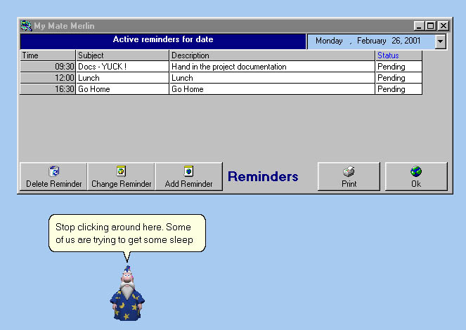



## MyMate \- With MSagent , reminders, UDP chat , Capture Tool, Task List, Print from Grid etc etc

### Description

It is a DeskTop Task/Reminder Manager. You need to have MSagent and some characters installed. It has a simple UDP chat program. It also has some nice Capture tools (Screen Active Form etc etc) I got the capture code from someone else...can't remember. It has a Task Manager and a Reminder Manager. The Agent is selectable and keeps making snotty remarks. It lives in the IconTray. REALLY HANDY program to keep track of you "To Do" list. Please comment...thanx
 
### More Info
 

             |
---                |---
**Submitted On**   |2001-02-26 09:57:48
**By**             |[N/A](https://github.com/Planet-Source-Code/PSCIndex/blob/master/ByAuthor/empty.md)
**Level**          |Advanced
**User Rating**    |5.0 (30 globes from 6 users)
**Compatibility**  |VB 6\.0
**Category**       |[Complete Applications](https://github.com/Planet-Source-Code/PSCIndex/blob/master/ByCategory/complete-applications__1-27.md)
**World**          |[Visual Basic](https://github.com/Planet-Source-Code/PSCIndex/blob/master/ByWorld/visual-basic.md)
**Archive File**   |[CODE\_UPLOAD155022262001\.zip](https://github.com/Planet-Source-Code/mymate-with-msagent-reminders-udp-chat-capture-tool-task-list-print-from-grid-etc-etc__1-21342/archive/master.zip)

